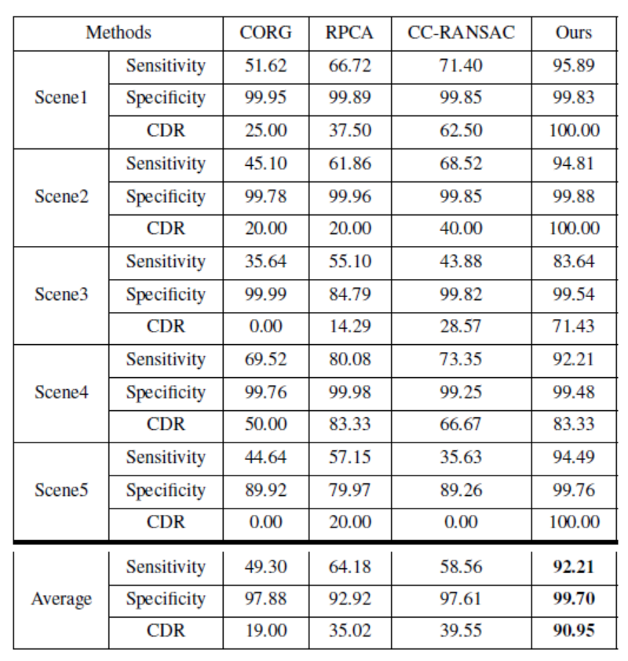

## Robust Plane Detection using Depth Information from a Consumer Depth Camera

The whole work is implemented in Matlab and no further libs are included. If you meet any problems to run our codes please feel free to send us email: jinzhi_126@163.com

### Citation

If you use these codes in your research, please cite:

	@article{Jin2017,
		author = {Zhi Jin and Tammam Tillo and Wenbin Zou and Yao Zhao and Xia Li},
		title = {Robust Plane Detection using Depth Information from a Consumer Depth Camera},
		journal = {IEEE Transactions on Circuits and Systems for Video Technology},
		year = {2017}
	}

### The framework of the proposed work 
 

### Results
<a href="http://tensorlayer.readthedocs.io">

	

</a>

<a href="http://tensorlayer.readthedocs.io">

	

</a>
